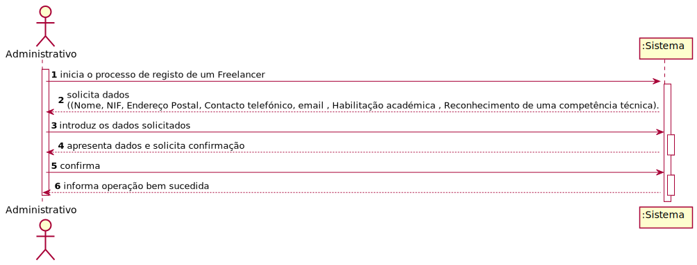
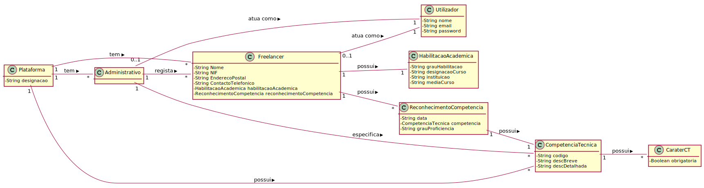

# UC7 - Registo de Freelancer

## 1. Engenharia de Requisitos

### Formato Breve

O administrativo inicia o processo de registo de um freelancer na plataforma. O sistema solicita os dados (Nome, NIF, Endereço Postal, Contacto telefónico, email , Habilitação académica , Reconhecimento de uma competência técnica).
O sistema valida e apresenta os dados ao administrativo, pedindo que os confirme. O administrativo confirma. O sistema regista os dados do Freelancer e informa o administrativo que o Freelancer em questão já pode aceder á Plataforma.

### SSD

### Formato Completo

#### Ator principal

Administrativo

#### Partes interessadas e seus interesses

* **Administrativo:** pretende registar um Freelancer na plataforma.
* **Freelancer:** Pretende aceder á Plataforma para começar a trabalhar.
* **T4J:** pretende que a plataforma possua Freelancers para que estes comecem a trabalhar nas tarefas colocadas na mesma .

#### Pré-condições

n/a

#### Pós-condições
O Freelancer em questão fique registado na plataforma.

#### Cenário de sucesso principal (ou fluxo básico)

1. O administrativo inicia o processo de registo de um Freelancer na plataforma.
2. O sistema solicita os dados (Nome, NIF, Endereço Postal, Contacto telefónico, email , Habilitação académica).
3. O administrativo introduz os dados solicitados.
4. O sistema mostra a lista de competências técnicas disponíveis  para que seja selecionada uma competência técnica e o Reconhecimento da mesma.
5. O administrativo introduz os dados solicitados.
6. **Os passos 4 a 5 repetem-se enquanto não forem introduzidas todas as competências técnicas do Freelancer pretendidas.**
7. O sistema valida e apresenta os dados ao administrativo, pedindo que os confirme.
8. O administrativo confirma.
9. O sistema regista os dados e informa o administrativo do sucesso da operação.

#### Extensões (ou fluxos alternativos)

*a. O administrativo solicita o cancelamento do registo de freelancer.

> O caso de uso termina.

4a. O sistema deteta que a lista de competências técnicas está vazia.
>1. O sistema informa ao administrativo do facto.  
>2. O sistema permite a especificação de uma nova competência técnica (UC4).  
> 2a. O administrativo não especifica uma competência técnica. O caso de uso termina.

5a. O administrativo não encontra a competência técnica pretendida.
>1. O administrativo informa o sistema do facto.  
>2. O sistema permite a especificação de uma nova competência técnica (UC4).  
> 2a. O administrativo não especifica uma competência técnica. O caso de uso termina.

7a. Dados mínimos obrigatórios em falta.
>	1. O sistema informa quais os dados em falta.
>	2. O sistema permite a introdução dos dados em falta (passo 3).
>
	>	2a. O administrativo não altera os dados. O caso de uso termina.

7b. O sistema deteta que os dados (ou algum subconjunto dos dados) introduzidos devem ser únicos e que estes já existem no sistema.
  >	1. O sistema alerta o administrativo para o facto.
  >	2. O sistema permite a sua alteração (passo 3).
  >
  	>	2a. O administrativo não altera os dados. O caso de uso termina.

7c. O sistema deteta que os dados introduzidos (ou algum subconjunto dos dados) são inválidos.
  > 1. O sistema alerta o administrativo para o facto.
  > 2. O sistema permite a sua alteração (passo 3).
  >
  	> 2a. O administrativo não altera os dados. O caso de uso termina.

**

#### Requisitos especiais
(enumerar requisitos especiais aplicáveis apenas a este UC)

\-

#### Lista de Variações de Tecnologias e Dados

\-

#### Frequência de Ocorrência

\-

#### Questões em aberto
Os dados proveniente dos recursos humanos são recebidos digitalmente ou de forma analógica ?
O Freelancer atua como um utilizador ?

## 2. Análise OO

### Excerto do Modelo de Domínio Relevante para o UC

## 3. Design - Realização do Caso de Uso

### Racional

| Fluxo Principal | Questão: Que Classe... | Resposta  | Justificação  |
|:--------------  |:---------------------- |:----------|:---------------------------- |
| Passo1  		 |							 |             |                              |
| Passo2  		 |							 |             |                              |
| Passo3  		 |							 |             |                              |
| Passo4  		 |							 |             |                              |
| Passo5  		 |							 |             |                              |
| Passo6  		 |							 |             |                              |              

### Sistematização ##

 Do racional resulta que as classes conceptuais promovidas a classes de software são:

 * Classe1
 * Classe2
 * Classe3

Outras classes de software (i.e. Pure Fabrication) identificadas:  

 * xxxxUI  
 * xxxxController

###	Diagrama de Sequência

###	Diagrama de Classes

