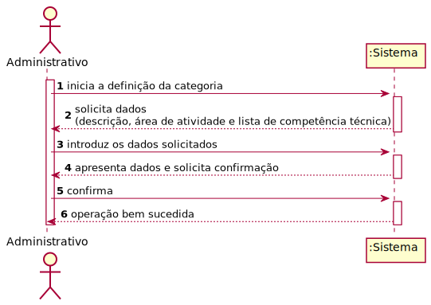
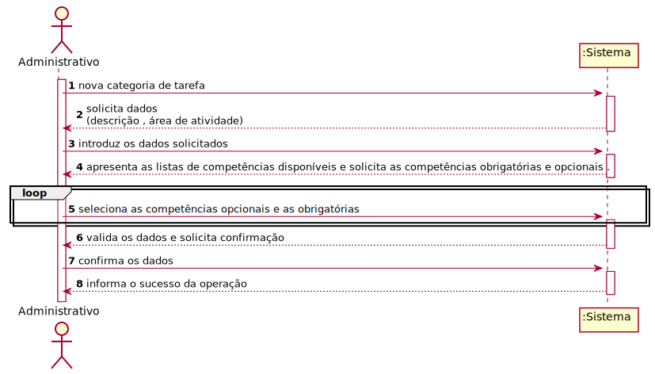
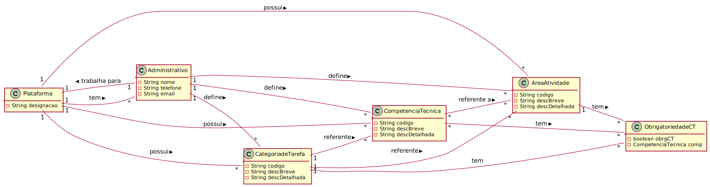
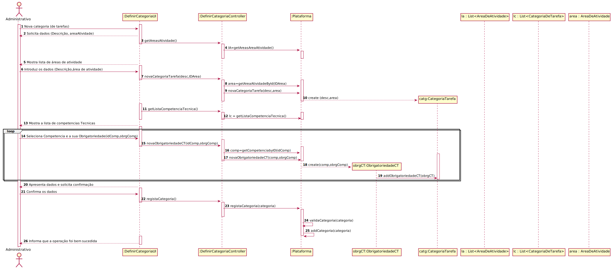
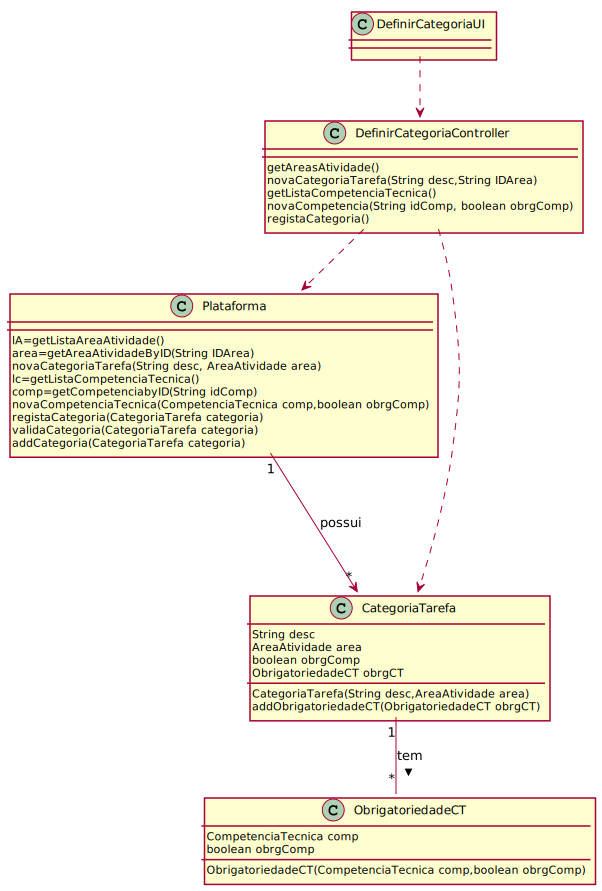

# UC 3 - Definir Categoria (de Tarefa)

## 3. Engenharia de Requisitos

### Formato Breve

O administrativo inicia o registo de uma nova categoria (de tarefa). O sistema solicita 
os dados (descrição, área de atividade , competencias tecnicas(Obrigátorias/Opcionais)). O administrativo insere os dados necessários.
O sistema valida os dados introduzidos e pede a confirmação ao administrativo.
O administrativo confirma os dados e o sistema informa do sucesso da operação.

### SSD

### Formato Completo

#### Ator principal

Administrativo

#### Partes interessadas e seus interesses

* **Administrativo**: pretende definir novas categorias de tarefas para que possam catalogar diferentes tarefas.
* **T4J**: pretende que a plataforma permita catalogar diversas tarefas em categorias de tarefa.

#### Pré-condições

Existerem compentêcias técnicas registadas na plataforma. 
Existerem áreas de ativade registadas na plataforma.

#### Pós-condições
Nova categoria de tarefa é registada no sistema 

1. O administrativo inicia a definição de uma nova categoria de tarefa.
2. O sistema solicita os dados necessários (descrição,área de atividade). 
3. O sistema apresenta a lista de areas de atividades.
4. O administrativo introduz os dados solicitados.
5. O sistema apresenta a lista de competências técnicas.
6. O administrativo seleciona competência técnica.
7. O sistema solicita obrigatoriedade
8. O administrativo introduz os dados solicitados.
9. Repetição do ponto 6 até ao ponto 8 até o administrativo não pretender mais competências técnicas.
10. O sistema valida e apresenta os dados, pedindo ao administrador que os confirme.
11. O administrativo confirma.
12. O sistema regista os dados da categoria de tarefa e informa o administrativo do sucesso da operação.

#### Extensões (ou fluxos alternativos)
**1.A**. O administrativo pede para cancelar a definição de categoria de tarefa
>       O caso de uso termina.

**10.A** Dados minimos obrigatórios em falta.
>       1. O sistema informa ao utilizador sobre os dados em falta.
>       2. O sistema permite a introdução dos dados em falta (passo 4/passo 8)
     >   2.A O administrativo não altera os dados. O caso de uso termina 

**10.B** O sistema deteta que os dados (ou algum subconjunto dos dados) introduzidos devem ser únicos e que já existem no sistema.
>       1. O sistema alerta o administrativo para o facto.
>       2. O sistema permite a sua alteração (passo 4/passo 8)
      >  2.A O administrativo não altera os dados. O caso de uso termina.
  
**10.C** O sistema deteta que os dados introduzidos (ou algum subconjunto dos dados) são inválidos.
>      1. O sistema alerta o adminstrativo sobre o facto e permite a alteração dos dados (passo 4/passo 8) .           
>      2. O administrativo altera os dados.  
>      3. O sistema valida os dados e solicita a confirmação dos dados introduzidos.        
>      4. O administrativo confirma os dados.
>      5. O caso de uso termina.
    
#### Requisitos especiais

n/a

#### Lista de Variações de Tecnologias e Dados

\-

#### Frequência de Ocorrência

\-

#### Questões em aberto

* É obrigatorio colocar todos os dados ? 
* O codigo generado automaticamente é publico ou apenas visiveis aos administradores?
* Existe limite de categorias para uma área de tarefas ? 
* Qual a frequência de ocorrência deste caso de uso ? 

## 2. Análise OO

### Excerto do Modelo de Domínio Relevante para o UC

## 3. Design - Realização do Caso de Uso

### Racional

| Fluxo Principal | Questão: Que Classe... | Resposta  | Justificação  |
|:--------------  |:---------------------- |:----------|:---------------------------- |
| 1. O administrativo inicia a definição de uma nova categoria de tarefa .  |	... interage com o utilizador? | DefinirCategoriaUI    | IE: Pure Fabrication, pois não se justifica atribuir esta responsabilidade a nenhuma classe existe no Modelo de Domínio. |
|  		 |	... coordena o UC?	| DefinirCategoriaController | IE: Controller    |
|  		 |	... cria instância de CategoriaTarefa| Plataforma   |  IE: Creator (Regra1)   |
| 2. O sistema solicita os dados necessários (i.e. descrição,área de atividade)                           |
| 3. O administrativo introduz os dados solicitados.  		 |	... guarda os dados introduzidos?  |  Categoria de Tarefa | IE: Catenformation Expert (IE) - instância criada no passo 1     |
| 4.  O sistema apresente a lista de competências e solicita uma competência tecnica e a sua obrigatoriedade | .....quem fornece ? | Plataforma | IE: A Plataforma possui Competencias.
| 5. O administrativo seleciona as competências obrigátorias e opcionais | ...guarda os |  Categoria de Tarefa |IE : Catenformation Expert (IE) - instância criada no passo 1
| 6. Repetição dos passos 4 e 5 até que o administrativo não pretenda mais . 
| 7.O sistema valida e apresenta os dados ao administrativo, pedindo que os confirme.   		 |	...valida os dados da Categoria (validação local) | CategoriaTarefa |  IE. Possui os seu próprios dados.|  	
|	 |	...valida os dados da Area (validação global) | Plataforma  | IE: A Plataforma possui/agrega CategoriaTarefa  |
| 8. O administrativo confirma.   		 |							 |             |                              |
| 9. O sistema regista os dados e informa o administrativo do sucesso da operação.  		 |	... guarda a CategoriaTarefa criada? | Plataforma  | IE: No MD a Plataforma possui CategoriaTarefa|  
             

### Sistematização ##

 Do racional resulta que as classes conceptuais promovidas a classes de software são:

 * Plataforma 
 * CategoriaTarefa
 

Outras classes de software (i.e. Pure Fabrication) identificadas:  

 * DefenirCategoriaUI
 * DefenirCategoriaController

###	Diagrama de Sequência

###	Diagrama de Classes
