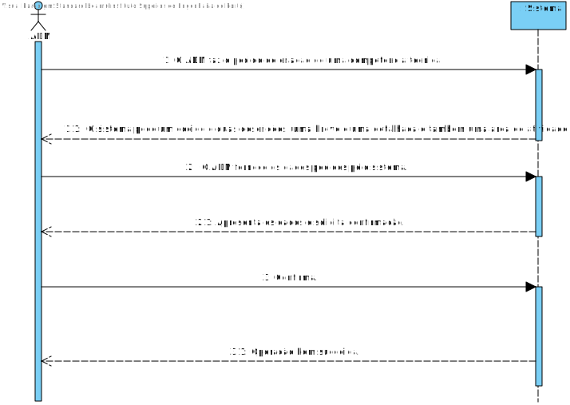
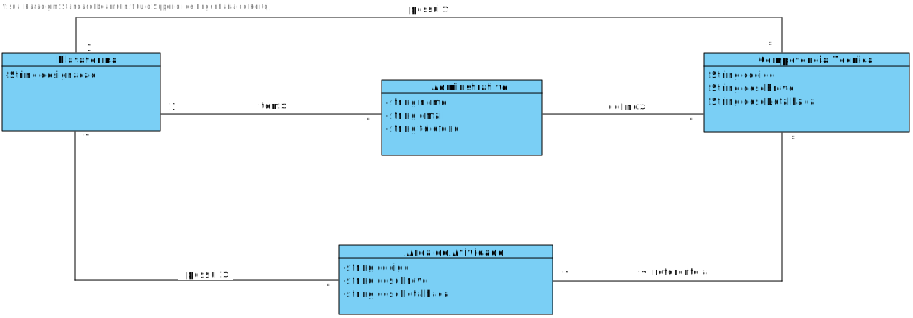
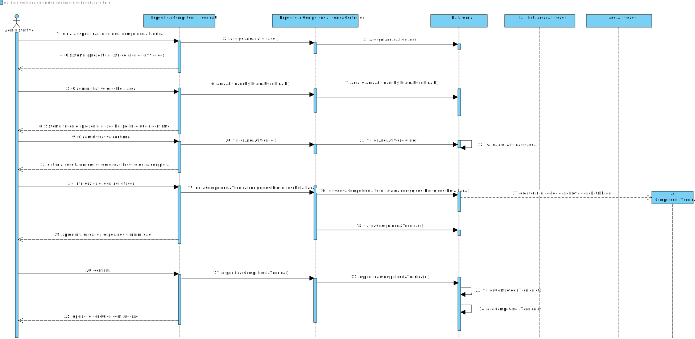
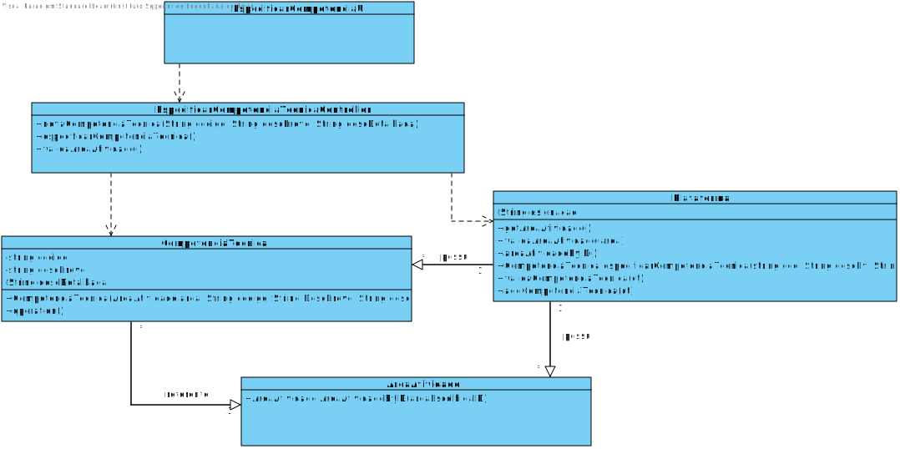

# UC 4-Especificar Competências Técnicas

## 1. Engenharia de Requisitos

### Formato Breve

 O administrativo inicia a especificação de uma competência técnica(i.e código, descriçao breve e detalhada, área de atividade...). O administrativo intoduz então os dados solicitados.O sitema valida e apresenta os dados, pedindo que os confirme. O administrativo confirma. O sistema regista os dados conforme o administrativoda operação.

### SSD

### Formato Completo

#### Ator principal

 Administrativo

#### Partes interessadas e seus interesses

* **Administrativo:** pretende definir as competências para serem então depois catalogadas com categorias de tarefas nas áreas de atividade.
* **T4J:** Pretende que a plataforma permita catalogar as competênciatecnicas e as suas categorias de tarefas em áreas de atividade.

#### Pré-condições

É necessário já existir  uma área de atividade referente a essa competência técnica.

#### Pós-condições
A informação de competência técnica é registada no sistema.

#### Cenário de sucesso principal (ou fluxo básico)

1. O administrativo inicia a especificação de uma competência técnica.
2. O sistema apresenta a lista de atividadades.
3. O sistema escolhe uma área.
4. O siatema valida e apresenta a escolha,pedindo que a confirme.
5. O administrativo confirma.
6. O sistema solicita os dados necessários(i.e código,descrição breve e detalhada, e uma dada área de atividade.
7. O administrativo intoduz os dados solicitados.
8. O sistema valida e apresenta os dados ao administrativo pedindo que os confirme. 
9. O administrativo confirma.
10. O sistema regista os dados das competências técnicas e informa o administrativo do sucesso da operação.

#### Extensões (ou fluxos alternativos)
 *a. O administrador solicita o cancelamento da especificação da competência técnica
 
 > O caso de uso termina.
 
 4a. Área de atividade não existe
 > 1. O sistema informa que a área de atividade não existe.
> 2. O sistema permite a introdução de novos dados para a especificação de  uma nova área de atividade (passo 3)
 >
 	>	2a. O administrador não altera os dados. O caso de uso termina.
 
 4b. Dados mínimos obrigatórios em falta.
 >1. O sistema informa quais os dados em falta.
 >2. O sistema permite a introdução dos dados em falta (passo 3)
 >
 	>	2a. O administrador não altera os dados. O caso de uso termina.

 4c. O sistema deteta que os dados (ou algum subconjunto dos dados) introduzidos devem ser únicos e que já existem no sistema.
 > 1. O sistema avisa o administrador para o facto.
 > 2. O sistema permite a sua alteração (passo 3)
 >
 	>	2a. O administrador não altera os dados. O caso de uso termina.
   
5a. O administrativo não confirma.
> 1. O sistema permite a introdução de novos dados para a especificação de  uma nova área de atividade (passo 3)
>
	>	2a. O administrador não altera os dados. O caso de uso termina.
    
8a. O administrativo não insere nenhum código para a competência técnica.
> 1. O sistema informa que não foi introduzido nenhum código.
> 2. O sistema permite a sua alteração (passo 7).
>
	>	2a. O administrador não altera os dados. O caso de uso termina.
   
8b. O administrativo insere um código já existente  para a competência técnica.
> 1. O sistema avisa o administrador para o facto.
> 2. O sistema permite a sua alteração (passo 7)
>
	>	2a. O administrador não altera os dados. O caso de uso termina.
    
8c. O administrativo não insere nenhuma descrição breve.
> 1. O sistema informa que não foi introduzido nenhuma descrição breve.
> 2. O sistema permite a sua alteração (passo 7).
>
	>	2a. O administrador não altera os dados. O caso de uso termina.
    
8d. O administrativo não insere nenhuma descrição Detalhada.
> 1. O sistema informa que não foi introduzido nenhuma descrição detalhada.
> 2. O sistema permite a sua alteração (passo 7).
>
	>	2a. O administrador não altera os dados. O caso de uso termina.
    
8e. O administrativo introduz uma competência técnica já existente.
> 1. O sistema informa que já existe a competência técnica.
> 2. O sistema permite a sua alteração (passo 7).
>
	>	2a. O administrador não altera os dados. O caso de uso termina.

9a. O administrativo não confirma.
> 1. O sistema permite a introdução de novos dados(codigo, descBreve, descDetalhada e também área de atividade).
>
    >	2a. O administrador não altera os dados. O caso de uso termina.

#### Requisitos especiais
 Tem que existir uma área de trabalho.

#### Lista de Variações de Tecnologias e Dados

\-

#### Frequência de Ocorrência
Sempre que um administrador quiser especificar uma nova competência técnica.

#### Questões em aberto

* Os códigos seguem alguma regra?
* As descrições devem seguir alguma norma?
* existem mais dados necessários?

## 2. Análise OO

### Excerto do Modelo de Domínio Relevante para o UC

## 3. Design - Realização do Caso de Uso

### Racional
| Fluxo Principal | Questão: Que Classe... | Resposta  | Justificação  |
|:--------------  |:---------------------- |:----------|:---------------------------- |
| 1. O administrativo inicia a especificação da competência técnica. |	... interage com o Administrativo? | EspecificarCompetenciaTecnicaUI   |  Pure Fabrication, pois não se justifica atribuir esta responsabilidade a nenhuma classe existe no Modelo de Domínio. |
|  		 |	... coordena o UC?	|EspecificarCompetenciaTecnicaController | Controller    |
|  		 |	... cria instância de competência técnica? | Plataforma   | Creator (Regra1)   |
| 2. O sistema apresenta as listas de atividade  |...apresenta a lista de áreas de atividade | Plataforma | Pure Fabrication |
| 3. O administrativo escolhe uma área . |	|   |     |
| 4. O sistema valida e apresenta os dados ao administrativo, pedindo que os confirme.   		 |	...valida a área de atividade? | Plataforma | IE. Possui áreas de atividades registadas .|  
| 5. O administrativo confirma.   		 | ...valida a área de atividade? | Plataforma | IE. Possui áreas de atividades registadas .|
| 6. Depois de guardada a área de atividade o sistema solicita um código, uma descrição breve e também uma descrição completa |
|    | ...associa a área de atividade à competência técnica? | Plataforma  | IE. Possui áreas de atividades e as competências técnicas registadas |
| 7. O administrativo introduz os dados solicitados.  		 |	... guarda os dados introduzidos?  |   CompetenciaTecnica | Information Expert (IE) - instância criada no passo 1     |
| 8. O sistema valida e apresenta os dados ao administrativo, pedindo que os confirme.   		 |	...valida os dados da competência técnica( validação local) | CompetenciaTecnica |                              |IE. Possui os seu próprios dados.|  	
|	 |	...valida os dados da Competenccia técnica(validação local) | AreaAtividade  | IE: possui os seus proprios dados  |
|	 |	...valida os dados da Competenccia técnica(validação global) | Plataforma  | IE: A Plataforma contém as Competencias técnicas registadas. 
| 9.O administrativo confirma.   		 |							 |             |                            |
| 10. O sistema regista os dados e informa o administrativo do sucesso da operação.  		 |	... guarda Competência Técnica criada? | Plataforma  | IE: No MD a Plataforma possui AreaAtividade| IE: No MD a plataforma tem competência tecnica.|
   
### Sistematização ##

 Do racional resulta que as classes conceptuais promovidas a classes de software são:

 * Plataforma
 * CompetenciaTecnica
 * AreaAtividade

Outras classes de software (i.e. Pure Fabrication) identificadas:  

 * EspecificarCompetenciaTecnicaUI 
 * EspecificarCompetenciaController

###	Diagrama de Sequência

###	Diagrama de Classes

