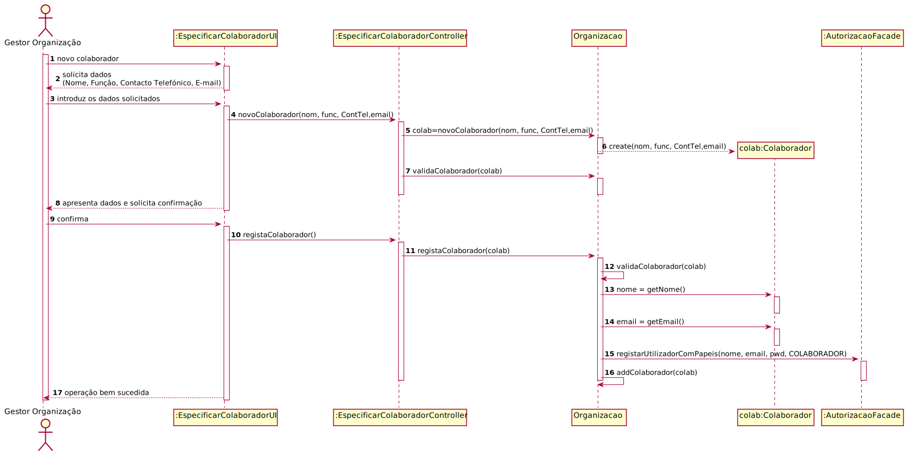

# UC5 - Especificar Colaborador de Organização

## 1. Engenharia de Requisitos

### Formato Breve

O Gestor de Organização inicia a especificação de colaborador de organização. 
O sistema solicita os dados necessários sobre o colaborador (i.e. nome, função, contacto telefónico, email e pwd).
O Gestor de Organização fornece os dados solicitados.
O sistema valida e apresenta os dados, pedindo que os confirme.
O Gestor de Organização confirma. 
O sistema regista os dados do colaborador e informa o Gestor de Organização do sucesso da operação.

### SSD

### Formato Completo

#### Ator principal

Gestor

#### Partes interessadas e seus interesses

* **Gestor**: pretende especificar o colaborador de organização.
* **T4J**: pretende que a organização em causa especifique os colaboradores.

#### Pré-condições

n/a

#### Pós-condições
É especificado um colaborador de organização.

#### Cenário de sucesso principal (ou fluxo básico)

1. O gestor inicia a especificação de colaborador de organização. 
2. O sistema solicita os dados necessários sobre o colaborador (i.e. nome, função, contacto telefónico, email e pwd).
3. O gestor fornece os dados solicitados.
4. O sistema valida e apresenta os dados, pedindo que os confirme.
5. O gestor confirma.
6. O sistema regista os dados da organização e do seu colaborador/gestor, tornando este último um utilizador registado e informa o gestor do sucesso da operação.

#### Extensões (ou fluxos alternativos)

 *a. O gestor solicita o cancelamento da especificação do colaborador.
 
> O caso de uso termina. 

4a. Dados mínimos obrigatórios em falta.
> 1. O sistema informa quais os dados em falta.
> 2. O sistema permite a introdução dos dados em falta (passo 3)
>
  > 2a. O gestor não altera os dados. O caso de uso termina. 


4b. O sistema deteta que os dados (ou algum subconjunto dos dados) introduzidos devem ser únicos e que já existem no sistema.
> 1. O sistema alerta o gestor para o facto.
> 2. O sistema permite a sua alteração (passo 3)

>
   > 2a. O gestor não altera os dados. O caso de uso termina. 


#### Requisitos especiais

\-

#### Lista de Variações de Tecnologias e Dados

\-

#### Frequência de Ocorrência

\-

#### Questões em aberto

* Existem outros dados obrigatórios para além dos já conhecidos?
* Quais os dados que em conjunto permitem detetar a duplicação de organizações (e de gestores)?
* É necessário existir algum mecanismo de segurança adicional para confirmar que a organização existe?
* Qual a frequência de ocorrência deste caso de uso?
* Uma organização pode ter mais do que um colaborador?

## 2. Análise OO

### Excerto do Modelo de Domínio Relevante para o UC

## 3. Design - Realização do Caso de Uso

### Racional

| Fluxo Principal | Questão: Que Classe... | Resposta  | Justificação  |
|:--------------  |:---------------------- |:----------|:---------------------------- |
| 1. O gestor inicia a especificação de um colaborador. | ... interage com o gestor? | EspecificarColaboradorUI | Pure Fabrication |
| | ... coordena o UC?  | EspecificarColaboradorController | Controller |
| | ... cria instâncias de Colaborador? | Organização | Creator(regra1) |
| 2. O sistema solicita os dados necessários sobre o colaborador (i.e. nome, função, contacto telefónico, email). |							 |             |                              |
| 3. O gestor introduz os dados solicitados.| ... guarda os dados introduzidos? |Colaborador |  Information Expert (IE) - instância criada no passo 1  |
| 4. O sistema valida e apresenta os dados, pedindo que os confirme.  |	... valida os dados do Colaborador? (local) | Colaborador  | IE: possui os seus próprios dados.    |
|  |	... valida os dados do Colaborador? (global) | Organização  | IE: A organização possui Colaborador.    |
|  |	... apresenta os dados de confimação? | EspecificarColaboradorUI  |  |
| 5. O gestor confirma.  |							 |             |                              |
| 6. O sistema regista os dados do colaborador e informa o gestor do sucesso da operação.  |	... guarda o Colaborador criado? | Organização |  IE: No MD a Organização possui Colaborador  |

### Sistematização ##

 Do racional resulta que as classes conceptuais promovidas a classes de software são:

* Plataforma
* Organização 
* Colaborador
* Gestor

Outras classes de software (i.e. Pure Fabrication) identificadas:  

* EspecificarColaboradorUI
* EspecificarColaboradorController

###	Diagrama de Sequência

###	Diagrama de Classes

