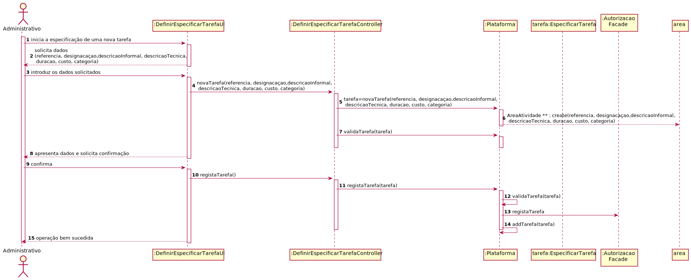

## UC 6 -  Especificar Tarefa
# Formato Breve
O colaborador de organização inicia a especificação de uma tarefa. O sistema então solicita 
os dados necessários (descrição de tarefa, área de atividade, lista de competências obrigatórias e 
lista de competências desejadas). O administrativo insere os dados requisitados.
O sistema então valida os dados introduzidos pelo administrativo e pede a devida confirmação. O administrativo confirma os dados e o sistema informa do sucesso da operação.

# SSD - Formato Breve

##	Formato completo

### Ator principal
* Administrativo

### Partes interessadas e seus interesses
* **Administrativo**: pretende definir novas categorias de tarefas para que possam catalogar diferentes tarefas.
* **T4J**: pretende que a plataforma permita catalogar diversas tarefas em categorias de tarefa.
* **Colaborador de organização**: possibilidade de especificar tarefa.

### Pré-condições
* n/a

### Pós-condições
* Nova categoria de tarefa é registada no sistema 

### Cenário de sucesso principal (ou fluxo básico)
1. O colaborador de organização inicia a especificação de uma tarefa.
2. O sistema solicita dados necessários (i.e. referência única por organização, designação, descrição informal e de caráter técnico, estimativa de duração e custo).
3. O colaborador de organização introduz os dados solicitados.
4. **O sistema mostra a lista de categorias existentes e pede ao colaborador para selecionar uma.**
5. **O colaborador seleciona a categoria em que a tarefa se enquadra.**
6. O sistema valida e apresenta os dados ao colaborador de organização, pedindo que os confirme.
7. O colaborador de organização confirma os dados.
8. O sistema regista os dados e informa o colaborador de organização do sucesso da operação.

### Extensões (ou fluxos alternativos)
*a. O utilizador (Organizador) solicita cancelamento da definição.

+ O caso de uso termina.

6a. Dados mínimos obrigatórios em falta.

1. O sistema informa quais os dados em falta.
2. O sistema permite a introdução dos dados em falta (passo 3)

    2.a O utilizador (Organizador) não altera os dados. O caso de uso termina.

6b. O sistema detecta que os dados (ou algum subconjunto dos dados) introduzidos devem ser únicos e que já existem no sistema.

1. O sistema alerta o utilizador para esse facto.
2. O sistema permite a sua alteração (passo 3)

    2a. O utilizador (Organizador) não altera os dados. O caso de uso termina.

6c. O sistema detecta que os dados introduzidos (ou algum subconjunto dos dados) são inválidos.

1. O sistema alerta o utilizador para esse facto.
2. O sistema permite a sua alteração (passo 3)

    2a. O utilizador (Organizador) não altera os dados. O caso de uso termina.

## Requesitos Especiais
* n/a

## Lista de Variações de Tecnologias e Dados

\-

## Frequência de Ocorrência

\-

## Questões em aberto
+ É obrigatorio colocar todos os dados ?
+ O codigo generado automaticamente é publico ou apenas visiveis aos administradores?
+ Existe limite de categorias para uma área de tarefas ?
+ Qual a frequência de ocorrência deste caso de uso ? 

## 2. Análise OO

### Excerto do Modelo de Domínio Relevante para o UC

O processo de construção do modelo de domínio é baseado nos casos de uso, em especial os substantivos utilizados, e na descrição do enunciado.

## 3. Design - Realização do Caso de Uso

### Racional

| Fluxo Principal | Questão: Que Classe... | Resposta  | Justificação  |
|:--------------  |:---------------------- |:----------|:---------------------------- |
| 1. O colaborador de organização inicia a especificação de uma tarefa.  |	... interage com o utilizador? | EspecificarTarefaUI |  Pure Fabrication: não se justifica atribuir esta responsabilidade a nenhuma classe existente no Modelo de Domínio. |
|  		 |	... coordena o UC?	| EspecificarTarefaController | Controller    |
|  		 |	... cria instância de Tarefa? | Organizacao | Creator (Regra1): no MD a Organizacao possui Tarefa.   |
||...conhece o utilizador/gestor a usar o sistema?|SessaoUtilizador|IE: cf. documentação do componente de gestão de utilizadores.|
||...sabe a que organização o utilizador/colaborador pertence?|Plataforma|IE: conhece todas as organizações.|
|||Organização|IE: conhece os seus colaboradores.|
|||Colaborador|IE: conhece os seus dados (e.g. email). |
| 2. O sistema solicita os dados necessários (i.e. referência única por organização, designação, descrição informal e de caráter técnico, estimativa de duração e custo).  		 |							 |             |                              |
| 3. O colaborador de organização introduz os dados solicitados.  		 |	... guarda os dados introduzidos?  |   Tarefa | Information Expert (IE)-instância criada no passo 1: possui os seus próprios dados.     |
| 4. O sistema mostra a lista de categorias e pede ao colaborador de organização para selecionar uma.  		 |	... conhece a lista de categorias?  |  Plataforma  | IE: no MD a Plataforma possui todas as instâncias de Categoria.                             |
| 5. O colaborador seleciona a categoria em que a tarefa se enquadra. | ... guarda a categoria selecionada?	| Tarefa | IE: possui os próprios dados - no MD a Tarefa enquadra-se numa Categoria.                              |
| 6. O sistema valida e apresenta os dados ao colaborador de organização, pedindo que os confirme.   		 |	... valida os dados da Tarefa (validação local)? | Tarefa |              IE: possui os seus próprios dados.|  	
|	 |	... valida os dados da Tarefa (validação global)? | Organizacao  | IE: a Organizacao contém/agrega Tarefa.  |
| 7. O colaborador de organização confirma os dados.   		 |							 |             |                              |
| 8. O sistema regista os dados e informa o colaborador de organização do sucesso da operação.  		 |	... guarda a Tarefa criada? | Organizacao  | IE: a Organizacao contém/agrega Tarefa. |

### Sistematização ##

 Do racional resulta que as classes conceptuais promovidas a classes de software são:

 * Plataforma
 * Colaborador
 * Tarefa

Outras classes de software (i.e. Pure Fabrication) identificadas:  

 * EspecificarTarefaUI  
 * EspecificarTarefaController

###	Diagrama de Sequência

###	Diagrama de Classes

